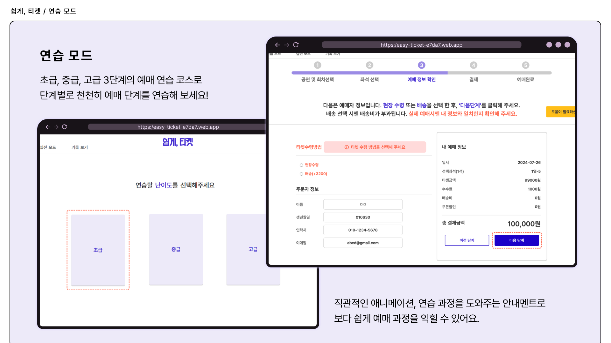
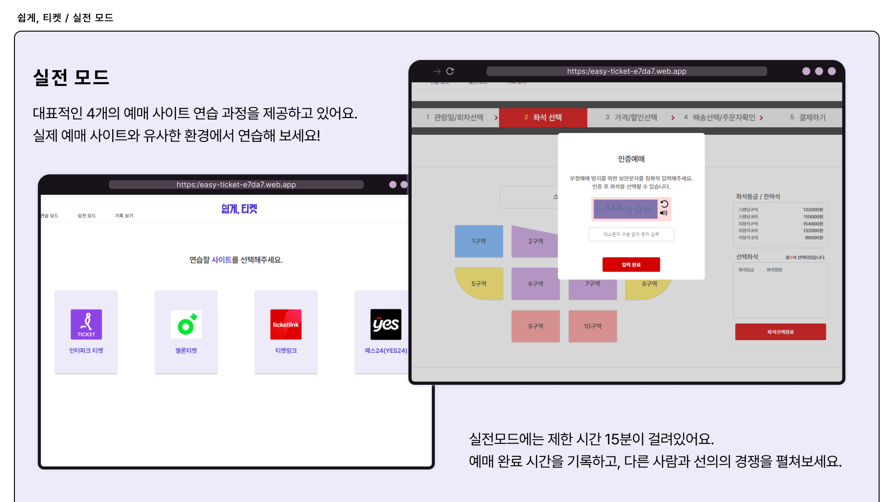
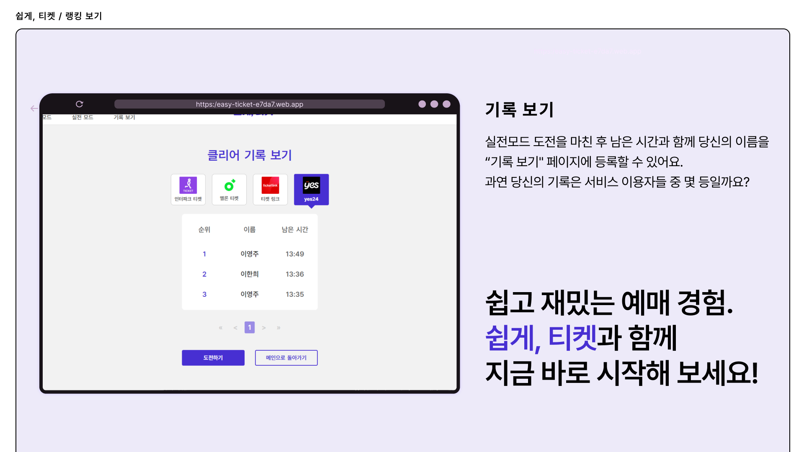

# 쉽게🎫티켓

### 누구나 쉽게 배우는 티켓팅 플랫폼! 쉽게, 티켓😎


## 목차

- [프로젝트 소개](#프로젝트-소개)
- [주요 기능](#주요-기능)
  - [연습 모드](#연습-모드)
  - [실전 모드](#실전-모드)
  - [기록 경쟁](#기록-경쟁)
- [팀 소개](#팀-소개)
- [팀원 소개](#팀원-소개)
- [기술 스택](#기술-스택)
- [기획 및 디자인](#기획-및-디자인)
  - [플로우차트](#플로우차트)
  - [와이어프레임](#와이어프레임)
- [프로젝트 실행](#프로젝트-실행)

## 프로젝트 소개

현재 다양한 이벤트, 공연, 스포츠 경기 등의 티켓 예매는 대부분 온라인에서 이루어지고 있습니다. 그러나 인터넷 사용에 익숙하지 않은 어르신분들 또는 사회적 약자들은 이러한 온라인 티켓팅에서 어려움을 겪고 있으며, 결과적으로 문화생활을 즐길 기회를 얻지 못하는 경우가 많습니다.

**쉽게티켓**은 이러한 문제를 해결하고자 합니다. 사용자들이 티켓팅 과정을 연습하면서 다양한 난이도의 문제를 경험하여 실제 상황에서의 대응 능력을 기를 수 있도록 도와줍니다. 디지털 격차 없이 누구나 예매 과정을 게임처럼 쉽게 배울 수 있습니다.

## 주요 기능

### 연습 모드



- 사용자는 난이도에 따라 점진적으로 어려워지는 티켓팅 문제를 해결하며 예매 기술을 향상시킬 수 있습니다.
- '도움이 필요합니다' 버튼을 눌러 보세요! 예매 과정을 진행하다 어려움이 발생할 시 힌트를 얻을 수 있습니다.

- 초급

  - 사용자가 어떤 버튼을 클릭하면 되는지 쉽게 인식할 수 있도록 안내문과 함께 애니메이션이 주어집니다.
  - 시간제한 없이, 차근차근 단계를 익힐 수 있습니다.

- 중급

  - 애니메이션 없이 안내문만 주어집니다.
  - 초급에 비해서, 사용자가 주도적으로 예매 과정을 진행할 수 있습니다.

- 고급

  - 애니메이션 없이 안내문만 주어집니다.
  - 30분의 시간 제한이 존재합니다. 시간 초과 시 한 번 더 재도전할 수 있습니다.

### 실전 모드



- 안내문 없이 실제 상황에서의 티켓팅 경험을 제공하여 실전 감각을 익힐 수 있습니다.
- 인터파크티켓, 멜론티켓, 티켓링크, YES24 사이트의 예매 과정을 체험해 볼 수 있습니다.

### 모드 추천

- 사용자가 사이트에 방문한 횟수를 측정합니다.
- 한 모드에서 10회 이상 연습을 진행할 경우 더 높은 단계의 모드를 추천합니다.  
  _ex. 초급 10회 진행 -> 연습모드 중급 단계 추천 툴팁 생성_

### 기록 경쟁



- 실전모드를 클리어한 기록을 사이트 별로 필터링 하여 보여줍니다.
- 사용자는 자신의 기록 순위와 타 사용자의 기록을 비교해볼 수 있습니다.

## 팀 소개

> 프로젝트에 대한 더 자세한 문서 및 컨벤션을 보고싶다면?  
> [👋 팀 노션 바로가기](https://abyss-2.notion.site/ac49d8e6e597422ba111bc38594ba2f4?pvs=4)

## 팀원 소개

| 고다은                                                             | 이영주                                                            | 이한희                                                             |
| ------------------------------------------------------------------ | ----------------------------------------------------------------- | ------------------------------------------------------------------ |
|  |  |  |
| [Daeun-100](https://github.com/Daeun-100)                          | [abyss-s](https://github.com/abyss-s)                             | [hanheel](https://github.com/hanheel)                              |
| FE                                                                 | FE                                                                | FE                                                                 |

## 기술 스택

| 카테고리      | 스택                                                                                                                                                                                                                                                                                                                                                                                                                                       |
| ------------- | ------------------------------------------------------------------------------------------------------------------------------------------------------------------------------------------------------------------------------------------------------------------------------------------------------------------------------------------------------------------------------------------------------------------------------------------ |
| Environment   |                                                                                                                                                                                                                              |
| Common        |                                                                                                                                                                                                                    |
| Language      |                                                                                                                                                                                                                    |
| Style         |                                                                                                                                                                                                                                                                                                            |
| Backend       |                                                                                                                                                                                                                                                                                                                              |
| Collaboration |     |

## 기획 및 디자인

### 플로우차트

[🔗 Figma 플로우 차트 바로가기](https://www.figma.com/design/T4qkBK4RUoaNogYGcOdNUa/Flowchart?node-id=0-1&t=JM4qqR4ZGELlcZ9E-1)

### 와이어프레임

[🔗 Figma 와이어프레임 바로가기](https://www.figma.com/design/weFlUZFznnC4M5X7X6Hni5/WISET-Project-Prototype-Design?node-id=4-498&t=qTZlgWDvJvPW1UC6-1)

## 프로젝트 실행

```
npm i
npm run dev
```

## 코멘트

(각자 배운점, 아쉬운점 같은 부분 적기)
